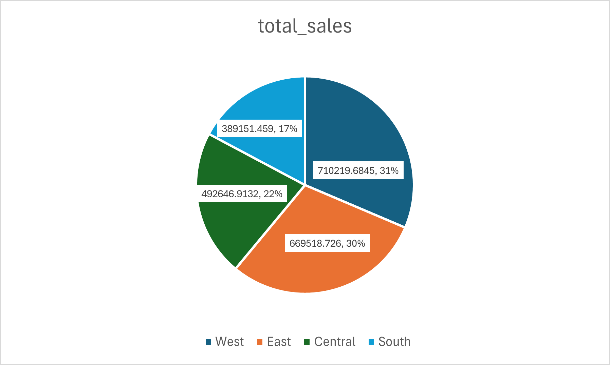
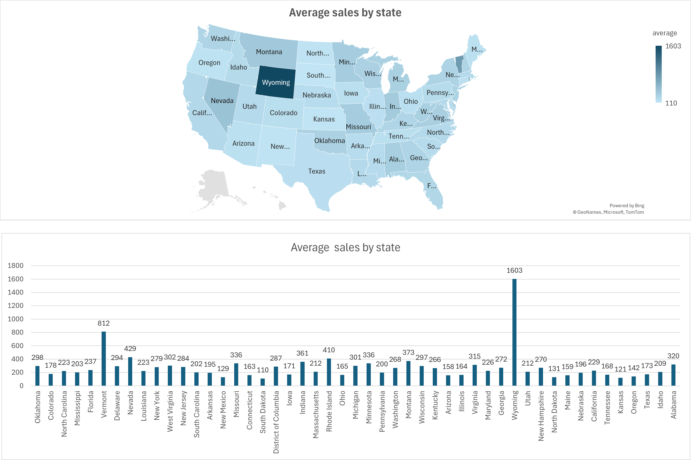
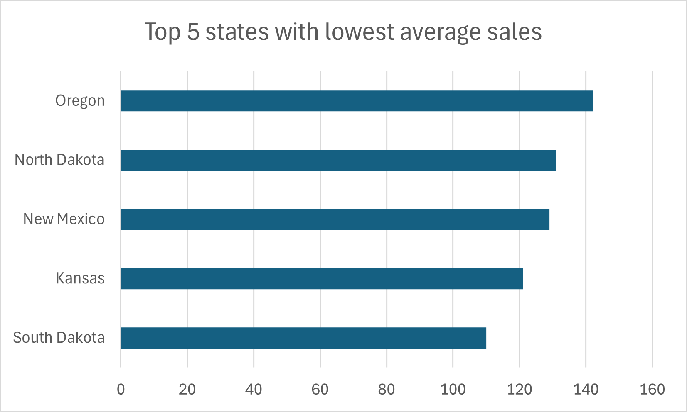
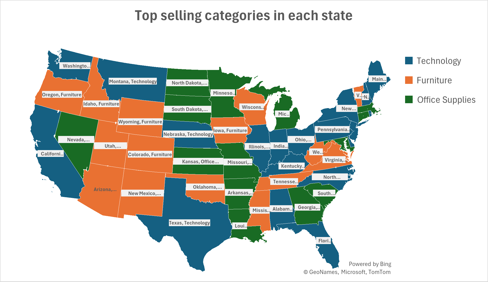
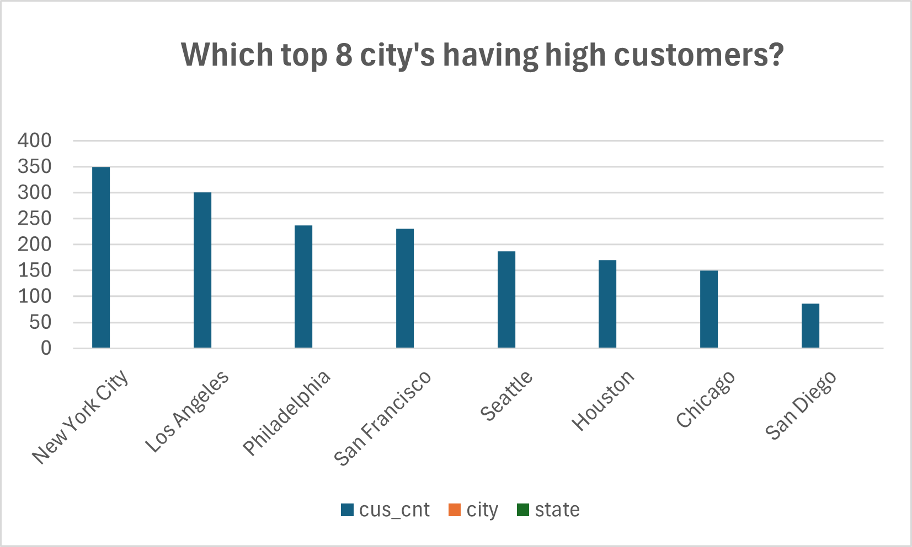
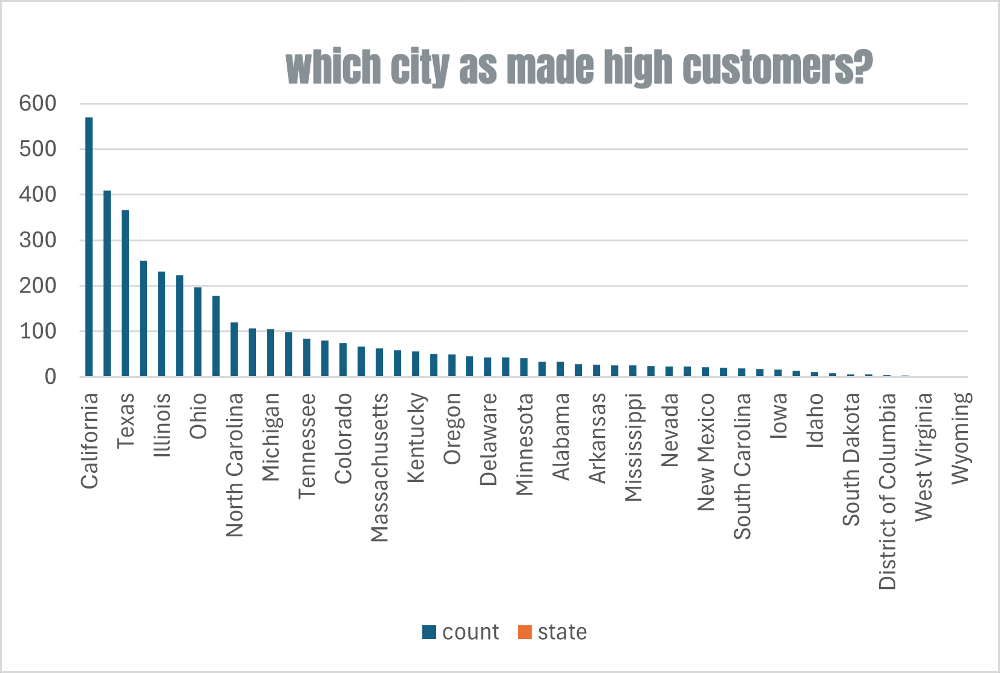
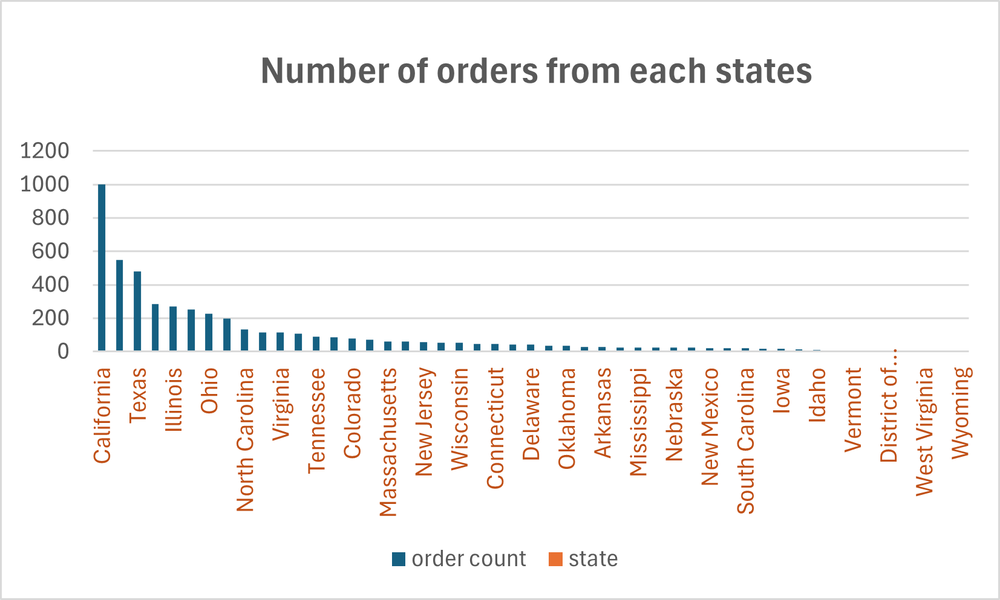
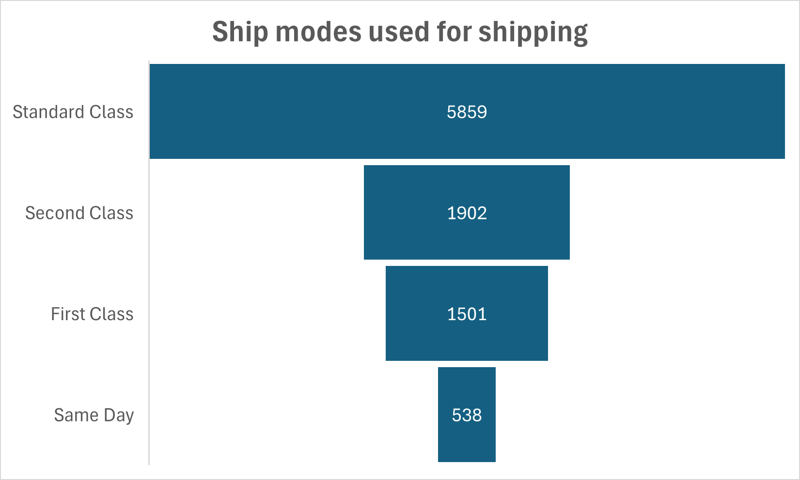
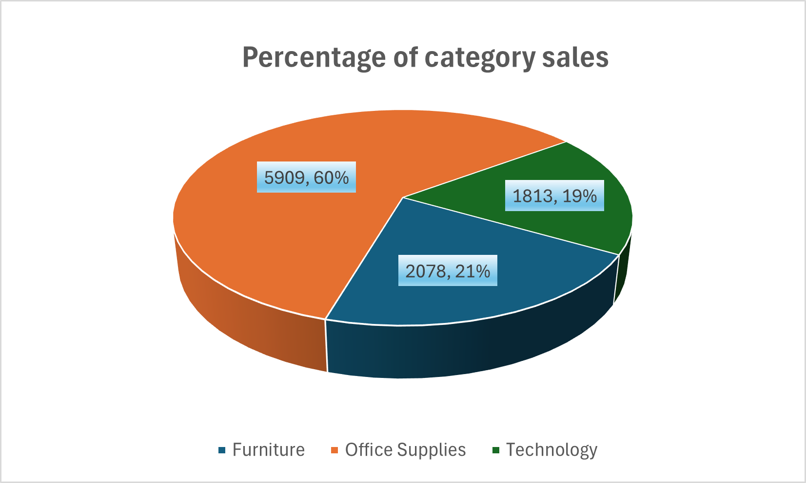

# 📊 Sales Data Analysis & Exploratory Data Analysis (EDA)
### Using SQL + Visualization

---

## 📌 Project Overview

This project performs **end-to-end Sales Analysis using SQL** to extract meaningful business insights from a retail dataset.

The analysis focuses on:

- 🌎 Regions, States, and Cities
- 📦 Products & Categories
- 🚚 Shipping & Logistics
- 👥 Customers
- 💰 Sales Trends

🎯 **Goal:** Enable data-driven decision making through structured SQL analysis and visual insights.

---

## 🎯 Business Questions Answered

- ❓ Which regions and states generate the highest and lowest sales?
- ❓ Which cities have the highest number of customers?
- ❓ What are the most demanded products and top categories?
- ❓ Which products take the highest number of days to ship?
- ❓ Which shipping modes are used most frequently?

---

## 🗂 Dataset Description

📦 **Dataset Type:** Retail sales transaction dataset  
🌍 **Geography:** United States

### 🧾 Key Columns Used

- `Order Date`
- `Ship Date`
- `Sales`
- `Region`
- `State`
- `City`
- `Category`
- `Product Name`
- `Customer ID`
- `Ship Mode`

---

## 🛠 Tools & Technologies Used

### 🧮 SQL
- CTEs
- Joins
- Aggregate Functions
- Window Functions
- Date Calculations

### 📊 Excel
- Data understanding
- Quick validation & summaries

### 📈 Data Visualization
- Chart-based insight representation

### 💻 GitHub
- Project documentation & version control

---

# 📊 Analysis Breakdown

---

## 🟦 Regional Sales Analysis

### 🔍 What Was Done
- Calculated total sales by region
- Compared average sales across regions
```
WITH descending_order_of_sales AS (
    SELECT city, SUM(sales) AS total_sales
    FROM sales
    GROUP BY city ),

    descending AS (
        SELECT *
        FROM descending_order_of_sales
        ORDER BY total_sales DESC
)
SELECT *
FROM descending
;
```
  
### 📌 Key Findings
- ✔️ West and East regions dominate total sales
- ✔️ South region shows the highest average sales
- ✔️ Central region records the lowest average sales

---

## 🟩 State-Wise Sales Analysis

### 🔍 What Was Done
- Calculated average sales for each state
```
SELECT state,
        ROUND(AVG(sales),0) AS average
FROM sales
GROUP BY state
;

```
- Identified Top 5 and Bottom 5 states
```
WITH average_sale AS (
    SELECT state,
            ROUND(AVG(sales),0) AS average
    FROM sales
    GROUP BY state

    ),
    order_by_sale AS (
        SELECT *
        FROM average_sale
        ORDER BY average DESC
    )

SELECT *
FROM order_by_sale
LIMIT 5
; 
```

#### Average sales for each state?
  
#### Top 5 state with lowest average sales?
  
### 📌 Key Findings

**Top Performers**
- Wyoming
- Vermont
- Nevada
- Rhode Island
- Montana

**Low Performers**
- South Dakota
- Kansas
- New Mexico
- North Dakota
- Oregon

- ✔️ Sales distribution is highly uneven across states

---

## 🟨 Category Performance Analysis

### 🔍 What Was Done
- Analyzed total sales by product category
```

```
- Identified top selling category in each state
#### Top selling categories in each state?
```
WITH most_sale_category AS (
    SELECT state,
        category,
        SUM(sales) AS sumsale
    FROM sales
    GROUP BY state,category
),
    rows_num AS (
        SELECT state,category,
        ROW_NUMBER() OVER(PARTITION BY state ORDER BY sumsale DESC) AS row_num
    FROM most_sale_category
    
    )
SELECT *
FROM rows_num;
```
  

### 📌 Key Findings
- ✔️ Office Supplies contribute ~60% of total sales
- ✔️ Category dominance varies significantly by geography

---

## 🟧 Customer & City Analysis

### 🔍 What Was Done
- Counted customers by city and state
```
SELECT COUNT(DISTINCT(customer_id)) AS cnt,
        state
FROM sales
GROUP BY(state)
ORDER BY cnt DESC
;
```
- Identified cities with high customer concentration
#### Which Top 8 cities having high cutsomers?
  
#### Which city as made highest customers?
  
### 📌 Key Findings
- ✔️ New York City and Los Angeles lead in customer count
- ✔️ Customer base is highly metro-city focused

---

## 🟥 Order Distribution Analysis

### 🔍 What Was Done
- Calculated number of orders from each state
```
SELECT COUNT(DISTINCT(order_id)) AS o_cnt,
        state
FROM sales
GROUP BY(state)
ORDER BY o_cnt DESC 
;
```
  
#### Number orders from each states
  
### 📌 Key Findings
- ✔️ California has the highest order volume
- ✔️ High order states generally show high sales

---

## 🟪 Shipping & Logistics Analysis

### 🔍 What Was Done
- Calculated shipping days using Order Date and Ship Date
```
WITH maximum AS (
    SELECT product_name,
            ship_date - order_date AS diff
    FROM sales
    ),
    get_maximum AS (
        SELECT MAX(diff) AS max_num
        FROM maximum -- identifies the maximum number 
    )

SELECT *
FROM maximum
WHERE diff = 7
;
```
- Analyzed shipping mode usage
- Identified products with long delivery time
#### Ship Mode used for shipping
  
### 📌 Key Findings
- ✔️ Standard Class is the most used shipping mode
- ✔️ Same Day shipping is least used
- ✔️ Certain products consistently face shipping delays

---

## 🟫 Product Demand Analysis

### 🔍 What Was Done
- Identified most demanded products by state
- Analyzed top 3 demanded products
```
SELECT COUNT(product_id) AS pro_cnt,
            product_id,
            product_name
FROM sales
GROUP BY product_id,product_name
ORDER BY pro_cnt DESC
;
```
### 📌 Key Findings
- ✔️ Product demand varies by geography
- ✔️ A small set of products drives majority demand

---

# 🔍 Overall Business Insights

- 📌 Sales and customers are concentrated in specific regions and metro cities
- 📌 Logistics heavily depend on Standard Class shipping
- 📌 Several low-performing states present growth opportunities
- 📌 Product and category demand differs significantly across locations
#### Pecentage of category sales
  
---

# ✅ Conclusion

- ✔️ Demonstrates strong SQL analytical skills
- ✔️ Converts raw data into actionable business insights
- ✔️ Reflects real-world Data Analyst problem solving
- ✔️ Resume & interview ready project

---

# 👤 Author

**Manoj H C**  
📌 Aspiring Data Analyst 
-- Linkedin : https://www.linkedin.com/in/manoj-h-c-65b26a34a/
